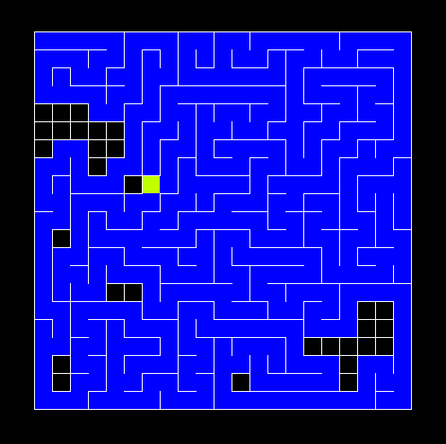
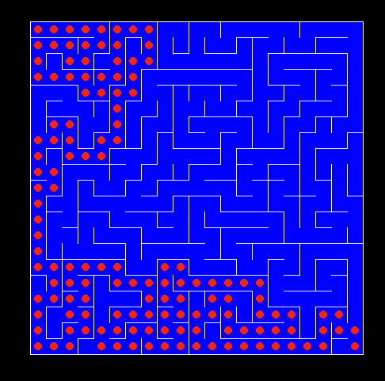

<h1> Maze Generation Visualisation </h1> 

 This repository contains program that generates mazes written in Python + Pygame. 

 

  

  

<h2> Install </h2>
<ol>
  <li> Make sure you have pip and python installed </li>
  <li> Clone this repo </li>
  <li> run pip install -r requirements.txt in your terminal/cmd </li>
  <li> run python main.py in your terminal/cmd </li>
</ol>
